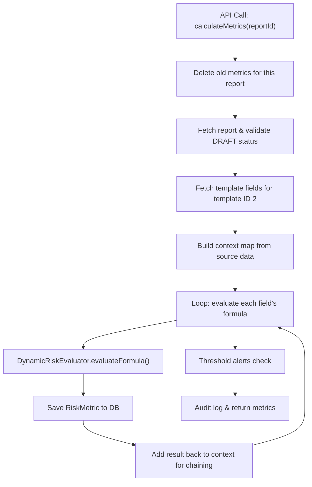
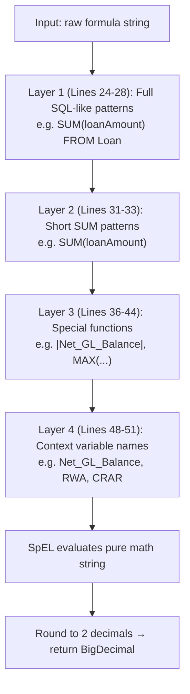

# Risk Calculation — Complete Trace Walkthrough

## Overall Flow



---

## Step 1 — Delete Old Metrics & Validate

```java
riskMetricRepository.deleteByReport_ReportId(reportId);  // Bulk DELETE via @Query
RegReport report = reportRepository.findById(reportId);   // Must be DRAFT
```

---

## Step 2 — Build Context Map (Pre-computed Aggregations)

All source data is fetched and aggregated **before** any formula runs:

| Context Key | Source | Example Value |
|---|---|---|
| `Total_Loans` | SUM of all `Loan.loanAmount` | 50,000,000 |
| `Total_Deposits` | SUM of all `Deposit.amount` | 60,000,000 |
| `Loan_to_Deposit_Ratio` | `Total_Loans / Total_Deposits * 100` | 83.33 |
| `Treasury_Exposure` | SUM of all `TreasuryTrade.notional` | 10,000,000 |
| `Net_GL_Balance` | SUM(credit) - SUM(debit) from GL | 8,000,000 |
| `RWA` | Each loan × risk weight | 37,500,000 |
| `MAX(Customer_Total_Load)` | Largest single customer exposure | 5,000,000 |

---

## Step 3 — DynamicRiskEvaluator: Layered Formula Resolution

The evaluator converts human-readable formulas into pure math strings using **4 layers** of replacement, executed in order:



---

## Trace 1: `SUM(loanAmount) + SUM(treasuryTradeNotional)`

```
START:   "SUM(loanAmount) + SUM(treasuryTradeNotional)"

Layer 1: No "... FROM Table" patterns found                    → no change
Layer 2: Line 31 → "SUM(loanAmount)" matched → replaced       → "50000000 + SUM(treasuryTradeNotional)"
         Line 32 → "SUM(treasuryTradeNotional)" matched        → "50000000 + 10000000"
Layer 3: No |...| or MAX(...) found                            → no change
Layer 4: No remaining variables                                → no change

SpEL:    "50000000 + 10000000" → 60000000.00
```

---

## Trace 2: `SUM(depositAmount)`

```
START:   "SUM(depositAmount)"

Layer 1: No "... FROM Table" patterns found                    → no change
Layer 2: Line 33 → "SUM(depositAmount)" matched               → "60000000"
Layer 3: No |...| or MAX(...)                                  → no change
Layer 4: No remaining variables                                → no change

SpEL:    "60000000" → 60000000.00
```

---

## Trace 3: `Net_GL_Balance / RWA * 100` (chained formula like CRAR)

```
START:   "Net_GL_Balance / RWA * 100"

Layer 1: No SUM(...) FROM patterns                             → no change
Layer 2: No SUM(...) patterns                                  → no change
Layer 3: contains "|Net_GL_Balance|"? ❌ NO (no pipe chars)    → no change
Layer 4: Loop through context map:
         → "Net_GL_Balance" found → replaced with "8000000"    → "8000000 / RWA * 100"
         → "RWA" found → replaced with "37500000"              → "8000000 / 37500000 * 100"

SpEL:    "8000000 / 37500000 * 100" → 21.33
```

> [!IMPORTANT]
> Layer 4 only works for CRAR because `Net_GL_Balance` and `RWA` were **already calculated** in earlier iterations and added back to the context via `context.put(field.getFieldName(), calculatedValue)`. **Template field order matters!**

---

## Key Concepts Summary

| Concept | Explanation |
|---|---|
| **`@Query` + `@Modifying`** | Custom bulk DELETE, avoids row-by-row deletion |
| **Context map** | Pre-computed values + results of prior formulas |
| **Formula chaining** | Each result is added back to context so later formulas can reference it |
| **Layered replacement** | 4 layers: SQL-like → short SUM → special functions → catch-all context loop |
| **SpEL** | Spring Expression Language parses the final math string and evaluates it |
| **`String.replace()`** | 1st arg = text to find, 2nd arg = text to substitute. No match = no change |
